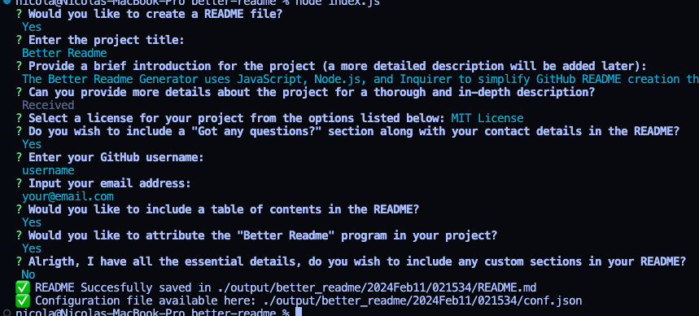

# Better Readme
  
 
1. [Intro](#Intro) 
2. [Description](#Description) 
3. [Installation](#Installation) 
4. [Usage](#Usage) 
5. [Preview](#Preview) 
6. [Contributing](#Contributing) 
7. [Tests](#Tests) 
8. [License](#License) 

## Intro
The Better Readme Generator uses JavaScript, Node.js, and Inquirer to simplify GitHub README creation through user-interactive prompts. 

## Description
The Better Readme Generator is a command-line tool built using JavaScript and Node.js, leveraging the Inquirer package to streamline the process of creating well-structured README files for your GitHub repositories. This tool aims to simplify the README creation process by prompting the user with a series of questions to gather essential information, allowing for customisation of various sections.

## Installation
1. Clone the repository
	`git clone https://github.com/sonictrain/better-readme`

2. Move inside the repo directory
	`cd better-readme`

3. Install dependencies using
	`npm install`

## Usage
Simply run the generator with `node index.js` or `npm start` and follow the prompts.
The generated files will be placed inside `./output` and folders with the current date will be created.
 
## Preview
 

## Contributing
All contributions from the community aiming to enhance and improve this project are welcome. If you have ideas for new features, encounter bugs, or want to contribute in any other way, please feel free to open an issue or submit a pull request. We appreciate your support in making this README generator even more robust and user-friendly.
 
## Tests
As of now, there are no specific tests implemented for this README Generator. However, enhancing the testing infrastructure is a priority for future development. If you're interested in contributing to the testing efforts, please feel free to reach out.
 
## Got any questions?
If you have any questions or feedback, please feel fre to reach out sending an email to the provided [email address](nicola.brucoli92@gmail.com) or [visiting the GitHub profile](http://github.com/sonictrain/). Your inquiries and input are valuable, appreciate your engagement with the project!

## License
A short and simple permissive license with conditions only requiring preservation of copyright and license notices. Licensed works, modifications, and larger works may be distributed under different terms and without source code. 

---

Generate with [Better Readme](https://github.com/sonictrain/better-readme) Copyright (c) 2024, [Nicola Brucoli](https://github.com/sonictrain).